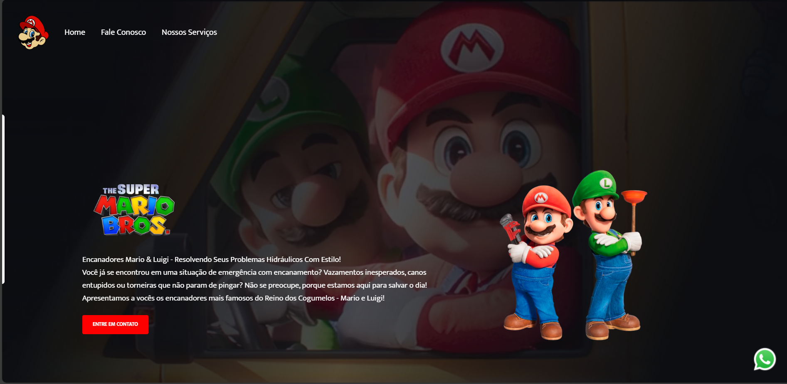

<h1>Mario Bros - Encanadores com Estilo! 💧</h1>

<h3> Imagens do projeto</h3>

Um site fictício e interativo inspirado nos irmãos Mario e Luigi, promovendo serviços hidráulicos com muito estilo e nostalgia! O projeto usa HTML, CSS e JavaScript puro para criar uma landing page animada e com formulário funcional de contato.

🛠️ Tecnologias Utilizadas
HTML5 – Estrutura da página
CSS3 – Estilização com animações e responsividade básica
JavaScript – Interatividade e manipulação do DOM
Formcarry – Integração com formulário de envio
Google Fonts (Mukta) – Tipografia personalizada

✨ Funcionalidades
Vídeo de fundo em loop com efeito de máscara escura para melhor leitura.
Botão de WhatsApp fixo no canto inferior direito.
Formulário de contato animado, com integração para recebimento via Formcarry.
Animação ao passar o mouse em botões e links de navegação.
Temática nostálgica do universo Mario, ideal para demonstrar criatividade em portfólios.

Feito com 💙 por Débora Iarcheski 
[LinkedIn](https://www.linkedin.com/in/debora-iarcheski/)
